# Tracks Import Process Flow

This document describes the process of importing tracking data from various formats (GEFF, CSV) into funtracks using the Builder Pattern.

## Builder Pattern Overview

The new builder pattern provides a unified interface for importing tracks from different formats while sharing common validation and construction logic.

```mermaid
graph TD
    Start([Start: Create Builder]) --> ReadHeader[1. read_header<br/>→ populate available_properties]

    ReadHeader --> InferMap[2. infer_name_map<br/>→ auto-infer standard mappings]

    InferMap --> UserEdit{User edits<br/>name_map?}
    UserEdit -->|Optional| EditMap[User modifies builder.name_map]
    UserEdit -->|No| ValidateMap
    EditMap --> ValidateMap

    ValidateMap[3. validate_name_map<br/>→ check required mappings exist]

    ValidateMap --> LoadSource[4. load_source<br/>→ InMemoryGeff with standard keys]

    LoadSource --> ValidateData[5. validate<br/>→ validate graph structure & IDs]

    ValidateData --> ConstructGraph[6. construct_graph<br/>→ NetworkX graph]

    ConstructGraph --> HandleSeg{Segmentation<br/>provided?}

    HandleSeg -->|Yes| LoadSeg[7. handle_segmentation<br/>→ load, validate, relabel if needed]
    HandleSeg -->|No| CreateTracks

    LoadSeg --> CreateTracks[8. Create SolutionTracks<br/>with graph & segmentation]

    CreateTracks --> EnableFeatures[9. enable_features<br/>→ register & compute features]

    EnableFeatures --> End([Return SolutionTracks])

    style ReadHeader fill:#4A90E2,stroke:#2E5C8A,stroke-width:3px,color:#fff
    style InferMap fill:#4A90E2,stroke:#2E5C8A,stroke-width:3px,color:#fff
    style ValidateMap fill:#F5A623,stroke:#C77D1A,stroke-width:3px,color:#fff
    style LoadSource fill:#4A90E2,stroke:#2E5C8A,stroke-width:3px,color:#fff
    style ValidateData fill:#F5A623,stroke:#C77D1A,stroke-width:3px,color:#fff
    style ConstructGraph fill:#50C878,stroke:#3A9B5C,stroke-width:3px,color:#fff
    style HandleSeg fill:#E94B8B,stroke:#B83A6D,stroke-width:3px,color:#fff
    style LoadSeg fill:#E94B8B,stroke:#B83A6D,stroke-width:3px,color:#fff
    style CreateTracks fill:#E85D75,stroke:#B84A5F,stroke-width:3px,color:#fff
    style EnableFeatures fill:#50C878,stroke:#3A9B5C,stroke-width:3px,color:#fff
```



## Process Steps

### 1. Preparation Phase (Blue)
**Read metadata and infer mappings**:

#### `read_header(source_path)`
- **Format-specific implementation** (abstract method)
- Reads only column names/property names without loading data
- **CSV**: Uses `pd.read_csv(source_path, nrows=0)` to read column names
- **GEFF**: Reads property names from zarr metadata using `GeffMetadata.read()`
- Populates `self.importable_node_props` and `self.importable_edge_props`

#### `infer_name_map()`
- **Common implementation** for all formats
- Automatically maps available properties to standard keys using fuzzy matching
- **Matching priority**:
  1. Exact matches to standard keys (e.g., "time" → "time")
  2. Fuzzy matches to standard keys (40% similarity, e.g., "t" → "time")
  3. Exact matches to feature display names (e.g., "Area" → "area")
  4. Fuzzy matches to feature display names (e.g., "Circ" → "circularity")
  5. Remaining properties map to themselves (custom properties)
- Returns inferred `name_map` dict (may be incomplete if required features cannot be matched)
- **Best-effort matching**: Does not validate completeness - use `validate_name_map()` to ensure all required fields are present

#### `prepare(source_path)`
- **Convenience method** that combines:
  1. `read_header(source_path)`
  2. `self.name_map = infer_name_map()`
- Allows user to inspect/modify `self.name_map` before building

### 2. Validation Phase (Yellow)
**Validate name_map before loading data**:

#### `validate_name_map()`
- **Common implementation** for all formats
- Validates that `self.name_map` contains:
  - All `required_features` (e.g., ["time"] for base, ["time", "id", "parent_id"] for CSV)
  - All `position_attr` based on `ndim` (["y", "x"] for 3D, ["z", "y", "x"] for 4D)
- Validates all mapped properties exist in `available_properties`
- Raises `ValueError` with helpful message if validation fails

### 3. Loading Phase (Blue)
**Convert source data to InMemoryGeff**:

#### `load_source(source_path, name_map, node_features)`
- **Format-specific implementation** (abstract method)
- Reads data from source using the validated `name_map`
- **CSV**:
  - Reads DataFrame
  - Renames columns using `name_map`
  - Converts to InMemoryGeff structure
  - Creates proper GeffMetadata with property metadata
- **GEFF**:
  - Uses `import_graph_from_geff()` with `name_map`
  - Returns InMemoryGeff directly
- All properties now use **standard keys**

### 4. Data Validation Phase (Yellow)
**Validate loaded InMemoryGeff**:

#### `validate()`
- **Common implementation** for all formats
- Validates graph structure (required - raises on failure):
  - `validate_unique_node_ids`: No duplicate node IDs
  - `validate_nodes_for_edges`: All edges reference existing nodes
  - `validate_no_self_edges`: No self-loops
  - `validate_no_repeated_edges`: No duplicate edges
- Validates optional properties (warns and removes if invalid):
  - `validate_tracklets`: track_id must form valid tracklets
  - `validate_lineages`: lineage_id must form valid lineages

### 5. Construction Phase (Green)
**Build NetworkX graph**:

#### `construct_graph()`
- **Common implementation** for all formats
- Constructs NetworkX DiGraph from validated InMemoryGeff
- Uses `geff.construct()` which creates graph with standard keys
- Graph nodes have all properties with standard names

### 6. Segmentation Phase (Pink)
**Handle segmentation if provided**:

#### `handle_segmentation(segmentation_path, scale)`
- **Common implementation** for all formats
- Lazy loads segmentation using `magic_imread(use_dask=True)`
- Validates segmentation dimensions match graph `ndim`
- **Relabeling logic**:
  - If no `seg_id` property: use segmentation as-is (assumes seg labels = node IDs)
  - If `seg_id == node_id` for all nodes: use segmentation as-is
  - Otherwise: relabel segmentation from seg_id → node_id per time point
- Returns processed segmentation array (or None)

### 7. Tracks Creation Phase (Red)
**Assemble SolutionTracks object**:

#### `build()` creates SolutionTracks
- Validates `self.name_map` is set (raises if empty)
- Calls `validate_name_map()` to ensure completeness
- Orchestrates all steps above
- Creates `SolutionTracks` with:
  - Constructed graph
  - Processed segmentation
  - Position and time attributes
  - Dimensionality and scale

### 8. Feature Registration Phase (Green)
**Enable and register features**:

#### `enable_features(tracks, node_features)`
- **Common implementation** for all formats
- Validates requested features exist (in annotators or node_props)
- Enables annotator features with appropriate `recompute` flag:
  - `recompute=True`: Compute using annotator
  - `recompute=False`: Use existing values from graph
- Registers static features (not in annotators) with inferred dtypes

## Usage Examples

### Using prepare() for automatic inference

```python
# Create builder
builder = CSVTracksBuilder()

# Read headers and auto-infer mappings
builder.prepare("data.csv")

# Optionally inspect/modify inferred mappings
print(builder.name_map)
builder.name_map["circularity"] = "circ"  # Custom override

# Build tracks
tracks = builder.build(
    source_path="data.csv",
    segmentation_path="seg.tif",
    scale=[1.0, 1.0, 1.0],
    node_features={"area": True, "custom_feature": False}
)
```

### Manual name_map specification

```python
# Create builder
builder = CSVTracksBuilder()

# Manually set name_map
builder.name_map = {
    "time": "t",
    "x": "x",
    "y": "y",
    "id": "id",
    "parent_id": "parent_id",
    "area": "Area"
}

# Read headers for validation
builder.read_header("data.csv")

# Build tracks (validates name_map automatically)
tracks = builder.build("data.csv")
```

## Key Design Decisions

### Why separate prepare() from build()?
1. **Allows user inspection**: Users can see inferred mappings before loading data
2. **Enables corrections**: Users can edit `name_map` if inference is incorrect
3. **Fail fast**: Validation happens before expensive data loading
4. **Clear separation**: Metadata reading vs. data loading

### Why validate before loading?
1. **Early error detection**: Catch mapping issues before loading large datasets
2. **Better error messages**: Can show available properties when mapping fails
3. **No wasted work**: Don't load data if mappings are invalid

### Why common validation?
1. **Consistency**: Same validation rules regardless of format
2. **GEFF standard**: InMemoryGeff format has well-defined validation
3. **Code reuse**: No format-specific validation duplication
4. **Graceful degradation**: Optional properties removed with warning, not error

### Why fuzzy matching with 40% cutoff?
1. **Handles variations**: "Time" vs "time", "t" vs "time", "Circ" vs "circularity"
2. **Balances precision**: 40% catches common abbreviations without false positives
3. **User override**: Still allows manual correction after auto-inference
4. **Follows precedent**: Matches existing motile_tracker behavior

### Why map remaining properties to themselves?
1. **Automatic custom features**: No need to specify every custom column
2. **Preserve all data**: Nothing is silently dropped
3. **User flexibility**: Custom properties work without explicit configuration

## Format-Specific Differences

### CSV Builder
- **Required features**: `["time", "id", "parent_id"]`
  - Graph structure stored in columns
- **read_header()**: Simple CSV column reading
- **load_source()**: DataFrame → InMemoryGeff conversion
  - Builds position from separate x, y, z columns
  - Extracts edges from parent_id column
  - Creates GeffMetadata with property metadata

### GEFF Builder
- **Required features**: `["time"]` only
  - Graph structure stored in separate arrays
- **read_header()**: Read zarr property names using `GeffMetadata.read()`
- **load_source()**: Direct InMemoryGeff loading
  - Uses existing `import_graph_from_geff()`
  - Metadata already present

## Submodule Organization

The import/export functionality is organized into format-specific submodules:

```
funtracks/import_export/
├── __init__.py              # Public API exports
├── _tracks_builder.py       # Abstract base builder class
├── _name_mapping.py         # Name inference helpers
├── _validation.py           # Validation functions
├── csv/
│   ├── _import.py          # CSVTracksBuilder + import_from_csv()
│   └── _export.py          # export_to_csv()
├── geff/
│   ├── _import.py          # GeffTracksBuilder + import_from_geff()
│   └── _export.py          # export_to_geff()
├── import_from_geff.py      # Deprecated shim (backward compat)
└── export_to_geff.py        # Deprecated shim (backward compat)
```

**Public API** (exported from `funtracks.import_export`):
- `import_from_csv()` - Wrapper around `CSVTracksBuilder`
- `import_from_geff()` - Wrapper around `GeffTracksBuilder`
- `export_to_csv()` - Export tracks to CSV format
- `export_to_geff()` - Export tracks to GEFF format

## Usage: Wrapper Functions vs Builder Pattern

Most users should use the **wrapper functions** which provide a simpler API:

### Recommended: Using Wrapper Functions

**GEFF Import** (auto-infers name_map):
```python
from funtracks.import_export import import_from_geff

tracks = import_from_geff(
    directory=Path("data.zarr"),
    name_map=None,  # Auto-infer column mappings
    segmentation_path=Path("seg.tif"),
    scale=[1.0, 1.0, 1.0],
    node_features={"area": True}
)
```

**CSV Import** (auto-infers name_map):
```python
from funtracks.import_export import import_from_csv

tracks = import_from_csv(
    csv_path=Path("tracks.csv"),
    name_map=None,  # Auto-infer column mappings
    segmentation_path=Path("seg.tif"),
    scale=[1.0, 1.0, 1.0],
    node_features={"area": False}
)
```

**CSV Import** (manual name_map):
```python
tracks = import_from_csv(
    csv_path=Path("tracks.csv"),
    name_map={"time": "frame", "x": "x_pos", "y": "y_pos", "id": "cell_id"},
    segmentation_path=Path("seg.tif")
)
```

### Advanced: Using Builder Pattern Directly

For advanced use cases where you need to inspect/modify the inferred name_map:

**GEFF Builder**:
```python
from funtracks.import_export.geff._import import GeffTracksBuilder

builder = GeffTracksBuilder()
builder.prepare(Path("data.zarr"))  # Auto-infer name_map

# Inspect and optionally modify inferred mappings
print(builder.name_map)
builder.name_map["circularity"] = "circ"  # Override a mapping

tracks = builder.build(
    source_path=Path("data.zarr"),
    segmentation_path=Path("seg.tif"),
    scale=[1.0, 1.0, 1.0],
    node_features={"area": True}
)
```

**CSV Builder**:
```python
from funtracks.import_export.csv._import import CSVTracksBuilder

builder = CSVTracksBuilder()
builder.prepare("data.csv")  # Auto-infer name_map

# Inspect and modify
print(builder.name_map)
builder.name_map["time"] = "frame_number"

tracks = builder.build(
    source_path="data.csv",
    segmentation_path="seg.tif"
)
```

### Benefits of Builder Pattern
- **Inspection**: Can see inferred mappings before loading data
- **Customization**: Can override specific mappings while keeping others
- **Fail fast**: Validation happens before expensive data loading
- **Unified interface**: Same API for CSV, GEFF, and future formats
