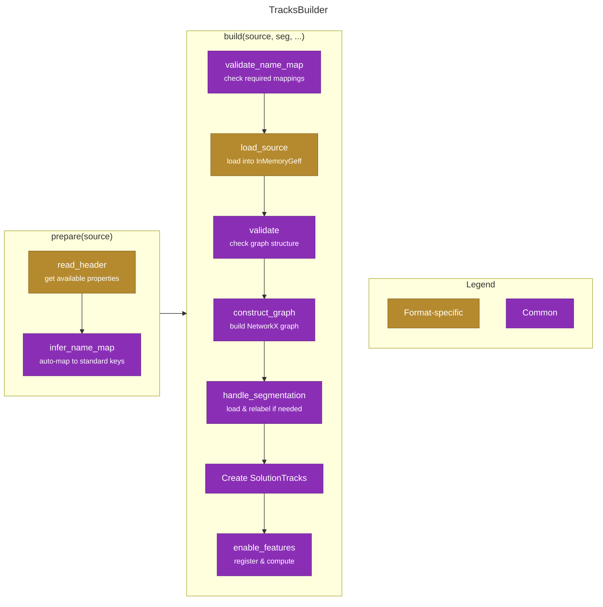

# Tracks Import Process Flow

This document describes the process of importing tracking data from various formats (GEFF, CSV) into funtracks using the Builder Pattern.

## Builder Pattern Overview

The builder pattern provides a unified interface for importing tracks from different formats while sharing common validation and construction logic.



## Process Steps

### Preparation Phase
**Read metadata and infer mappings**:

#### `read_header(source_path)` <span class="badge badge-gold">Format-specific</span>

- Populates `self.importable_node_props` and `self.importable_edge_props` from format metadata

#### `infer_name_map()` <span class="badge badge-purple">Common</span>

- Automatically maps importable node and edge properties to default keys
- **Matching priority**:
    1. Exact matches to standard keys (e.g., "time" → "time")
    2. Fuzzy matches to standard keys (40% similarity, e.g., "t" → "time")
    3. Exact matches to feature display names (e.g., "Area" → "area")
    4. Fuzzy matches to feature display names (e.g., "Circ" → "circularity")
    5. Remaining properties map to themselves (custom properties)
- **Best-effort matching**: Does not validate completeness - use `validate_name_map()` to ensure all required fields are present

#### `prepare(source_path)`
- **Convenience method** that combines:
  1. `read_header(source_path)`
  2. `self.name_map = infer_name_map()`
- Allows user to inspect/modify `self.name_map` before building

### Build Phase
**Validate, load, construct, and assemble tracks**:

#### `validate_name_map()` <span class="badge badge-purple">Common</span>

- Validates that `self.name_map` contains:
  - All `required_features` (e.g., ["time"] for base, ["time", "id", "parent_id"] for CSV)
  - All `position_attr` based on `ndim` (["y", "x"] for 3D, ["z", "y", "x"] for 4D)
- Validates all mapped properties in self.name_map and self.edge_name_map exist in importable properties
- Raises `ValueError` with helpful message if validation fails

#### `load_source(source_path, name_map, node_features)` <span class="badge badge-gold">Format-specific</span>

- Reads data from source using the validated `name_map` and turns into an InMemoryGeff
- All properties now use **standard keys**

#### `validate()` <span class="badge badge-purple">Common</span>

- Validates graph structure (required - raises on failure):
- Validates optional properties (warns and removes if invalid):
  - `validate_tracklets`: track_id must form valid tracklets
  - `validate_lineages`: lineage_id must form valid lineages

#### `construct_graph()` <span class="badge badge-purple">Common</span>

- Constructs NetworkX DiGraph from validated InMemoryGeff using `geff.construct()`

#### `handle_segmentation(segmentation_path, scale)` <span class="badge badge-purple">Common</span>

- Lazy loads segmentation using `magic_imread(use_dask=True)`
- Validates segmentation dimensions match graph `ndim`
- **Relabeling logic**:
  - If no `seg_id` property: use segmentation as-is (assumes seg labels = node IDs)
  - If `seg_id == node_id` for all nodes: use segmentation as-is
  - Otherwise: relabel segmentation from seg_id → node_id per time point
- Returns processed segmentation array (or None)

#### `enable_features(tracks, node_features)` <span class="badge badge-purple">Common</span>

- Validates requested features exist (in annotators or node_props)
- Enables annotator features with appropriate `recompute` flag:
  - `recompute=True`: Compute using annotator
  - `recompute=False`: Use existing values from graph
- Registers static features (not in annotators) with inferred dtypes

## Usage Examples

### Using prepare() for automatic inference

```python
# Create builder
builder = CSVTracksBuilder()

# Read headers and auto-infer mappings
builder.prepare("data.csv")

# Optionally inspect/modify inferred mappings
print(builder.name_map)
builder.name_map["circularity"] = "circ"  # Custom override

# Build tracks
tracks = builder.build(
    source_path="data.csv",
    segmentation_path="seg.tif",
    scale=[1.0, 1.0, 1.0],
    node_features={"area": True, "custom_feature": False}
)
```

### Manual name_map specification

```python
# Create builder
builder = CSVTracksBuilder()

# Manually set name_map
builder.name_map = {
    "time": "t",
    "x": "x",
    "y": "y",
    "id": "id",
    "parent_id": "parent_id",
    "area": "Area"
}

# Read headers for validation
builder.read_header("data.csv")

# Build tracks (validates name_map automatically)
tracks = builder.build("data.csv")
```

## Format-Specific Differences

### CSV Builder
- **Required features**: `["time", "id", "parent_id"]`
  - Graph structure stored in columns
- **read_header()**: Simple CSV column reading
- **load_source()**: DataFrame → InMemoryGeff conversion
  - Builds position from separate x, y, z columns
  - Extracts edges from parent_id column
  - Creates GeffMetadata with property metadata

### GEFF Builder
- **Required features**: `["time"]` only
  - Graph structure stored in separate arrays
- **read_header()**: Read zarr property names using `GeffMetadata.read()`
- **load_source()**: Direct InMemoryGeff loading
  - Uses existing `import_graph_from_geff()`
  - Metadata already present

## Submodule Organization

The import/export functionality is organized into format-specific submodules:

```
funtracks/import_export/
├── __init__.py              # Public API exports
├── _tracks_builder.py       # Abstract base builder class
├── _name_mapping.py         # Name inference helpers
├── _validation.py           # Validation functions
├── csv/
│   ├── _import.py          # CSVTracksBuilder + tracks_from_df()
│   └── _export.py          # export_to_csv()
├── geff/
│   ├── _import.py          # GeffTracksBuilder + import_from_geff()
│   └── _export.py          # export_to_geff()
├── import_from_geff.py      # Deprecated shim (backward compat)
└── export_to_geff.py        # Deprecated shim (backward compat)
```

**Public API** (exported from `funtracks.import_export`):

- `tracks_from_df()` - Import tracks from pandas DataFrame
- `import_from_geff()` - Wrapper around `GeffTracksBuilder`
- `export_to_csv()` - Export tracks to CSV format
- `export_to_geff()` - Export tracks to GEFF format

## Usage: Wrapper Functions vs Builder Pattern

Most users should use the **wrapper functions** which provide a simpler API:

### Recommended: Using Wrapper Functions

**GEFF Import** (auto-infers name_map):
```python
from funtracks.import_export import import_from_geff

tracks = import_from_geff(
    directory=Path("data.zarr"),
    name_map=None,  # Auto-infer column mappings
    segmentation_path=Path("seg.tif"),
    scale=[1.0, 1.0, 1.0],
    node_features={"area": True}
)
```

**CSV/DataFrame Import**:
```python
import pandas as pd
from funtracks.import_export import tracks_from_df

# Read CSV into DataFrame
df = pd.read_csv("tracks.csv")

# Load segmentation array
seg = ... # Load your segmentation array (e.g., from tiff, zarr)

# Import tracks
tracks = tracks_from_df(
    df=df,
    segmentation=seg,  # Pre-loaded segmentation array
    scale=[1.0, 1.0, 1.0],
    features={"Area": "area"}  # Load area from 'area' column
)
```

### Advanced: Using Builder Pattern Directly

For advanced use cases where you need to inspect/modify the inferred name_map:

**GEFF Builder**:
```python
from funtracks.import_export.geff._import import GeffTracksBuilder

builder = GeffTracksBuilder()
builder.prepare(Path("data.zarr"))  # Auto-infer name_map

# Inspect and optionally modify inferred mappings
print(builder.name_map)
builder.name_map["circularity"] = "circ"  # Override a mapping

tracks = builder.build(
    source_path=Path("data.zarr"),
    segmentation_path=Path("seg.tif"),
    scale=[1.0, 1.0, 1.0],
    node_features={"area": True}
)
```

**CSV Builder**:
```python
from funtracks.import_export.csv._import import CSVTracksBuilder

builder = CSVTracksBuilder()
builder.prepare("data.csv")  # Auto-infer name_map

# Inspect and modify
print(builder.name_map)
builder.name_map["time"] = "frame_number"

tracks = builder.build(
    source_path="data.csv",
    segmentation_path="seg.tif"
)
```
