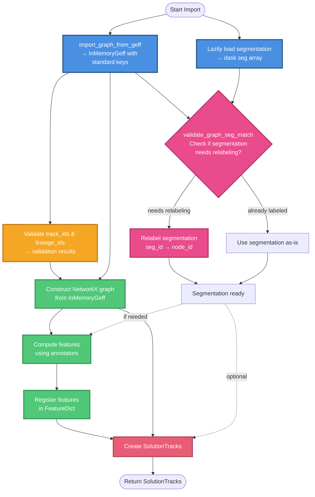

# GEFF Import Process Flow

This diagram shows the steps involved in importing tracking data from GEFF format and the dependencies between them.



## Process Steps

### 1. Loading Phase (Blue)
**Parallel operations** - can happen independently:
- **`import_graph_from_geff()`**: Loads GEFF data and renames all property keys from custom to standard
  - Reads GEFF data into `InMemoryGeff` format
  - Transforms custom property names to standard keys (e.g., `"t"` → `"time"`, `"circ"` → `"circularity"`)
  - Returns InMemoryGeff with standard keys
- **Load segmentation from disk**: Reads segmentation array from file (tif, zarr, etc.)

### 2. Validation Phase (Yellow)
**Sequential operations** on the loaded data:
- **Validate track_ids & lineage_ids**: Check if provided IDs are valid according to GEFF spec

### 3. Segmentation Validation Phase (Pink)
**Conditional operations** on segmentation:
- **Check if relabeling needed**: Compares segmentation IDs with node IDs
- **Relabel segmentation** (if needed): Maps seg_id values to node_id values
- **Use as-is** (if not needed): Segmentation already uses node IDs

### 4. Construction Phase (Green)
**Build the final data structures**:
- **Construct NetworkX graph**: Create graph from InMemoryGeff (now with standard keys)
- **Compute features**: Run annotators to compute features (may use segmentation)
- **Register features**: Add computed features to FeatureDict

### 5. Final Assembly (Red)
- **Create SolutionTracks**: Assemble all components into final Tracks object

## Key Dependencies

### Critical Path
The longest dependency chain:
```
import_graph_from_geff → Validate IDs → Construct graph →
Compute features → Register features → Create SolutionTracks
```

### Parallel Opportunities
- `import_graph_from_geff()` and segmentation loading are independent
- Segmentation validation can happen in parallel with track_id validation

### Design Insight
**Why `import_graph_from_geff()` returns standard keys:**

By renaming property keys in the InMemoryGeff *before* constructing the NetworkX graph:
1. Graph is created with standard keys from the start
2. No need for post-construction key renaming
3. All downstream code (validation, feature computation) works with standard keys
4. Single transformation point - simpler and more maintainable
