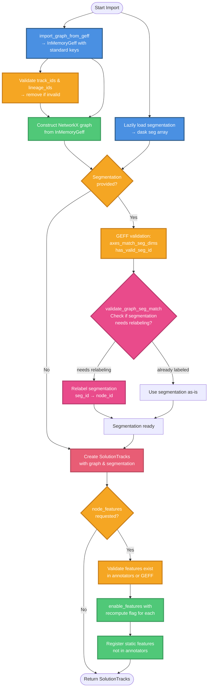

# GEFF Import Process Flow

This diagram shows the steps involved in importing tracking data from GEFF format and the dependencies between them.



## Process Steps

### 1. Loading Phase (Blue)
**Parallel operations** - can happen independently:
- **`import_graph_from_geff()`**: Loads GEFF data and renames all property keys from custom to standard
  - Reads GEFF data into `InMemoryGeff` format
  - Transforms custom property names to standard keys (e.g., `"t"` → `"time"`, `"circ"` → `"circularity"`)
  - Returns InMemoryGeff with standard keys
- **Load segmentation from disk**: Lazily reads segmentation array from file (tif, zarr, etc.) into dask array

### 2. Validation Phase (Yellow)
**Sequential operations** on the loaded data:
- **Validate track_ids & lineage_ids**: Check if provided IDs are valid according to GEFF spec, remove if invalid
- **GEFF-specific validation** (if segmentation provided):
  - **`axes_match_seg_dims`**: Check axes metadata matches segmentation dimensions
  - **`has_valid_seg_id`**: Validate seg_ids are integers
- **Feature validation** (if features requested):
  - Features with `recompute=True` must exist in annotators
  - Features with `recompute=False` must exist in GEFF node_props

### 3. Construction Phase (Green)
**Build the graph and tracks**:
- **Construct NetworkX graph**: Create graph from InMemoryGeff (now with standard keys)
- **Validate & relabel segmentation** (if provided):
  - Check if relabeling needed using generic `validate_graph_seg_match`
  - Relabel if seg_id ≠ node_id
- **Create SolutionTracks**: Assemble graph and segmentation into Tracks object

### 4. Segmentation Validation Phase (Pink)
**Conditional operations** on segmentation (happens after graph construction):
- **Check if relabeling needed**: Uses NetworkX graph to compare segmentation IDs with node IDs
- **Relabel segmentation** (if needed): Maps seg_id values to node_id values
- **Use as-is** (if not needed): Segmentation already uses node IDs

### 5. Feature Registration Phase (Green)
**Happens AFTER SolutionTracks creation** - if `node_features` provided:
- **Enable features**: Call `tracks.enable_features(key, recompute=flag)` for each feature
  - If `recompute=True`: Activates annotator and computes values
  - If `recompute=False`: Activates annotator but uses existing values from graph
- **Register static features**: Add non-annotator features to FeatureDict

### 6. Final Return (Red)
- **Return SolutionTracks**: Return fully configured Tracks object with features enabled

## Key Dependencies

### Critical Path
The longest dependency chain:
```
import_graph_from_geff → Validate IDs → Construct graph →
[if segmentation] GEFF validation → Validate match → Relabel (if needed) →
Create SolutionTracks → [if features] Validate & enable features
```

### Parallel Opportunities
- `import_graph_from_geff()` and segmentation loading are independent and can happen in parallel

### Design Insights

**Why `import_graph_from_geff()` returns standard keys:**
By renaming property keys in the InMemoryGeff *before* constructing the NetworkX graph:
1. Graph is created with standard keys from the start
2. No need for post-construction key renaming
3. All downstream code (validation, feature computation) works with standard keys
4. Single transformation point - simpler and more maintainable

**Why features are enabled AFTER SolutionTracks creation:**
1. Tracks object must exist before features can be computed or registered
2. Feature computation may require the tracks object (e.g., for segmentation access)
3. Separation of concerns: graph/segmentation construction vs. feature management
4. Allows validation of feature requests against available annotators
